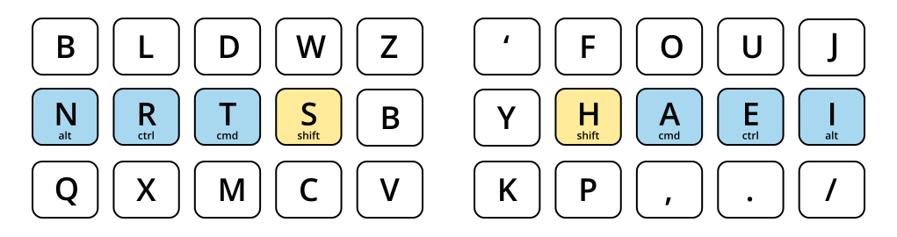
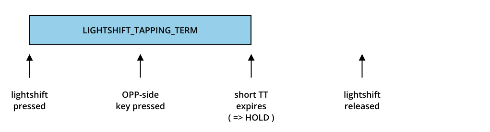
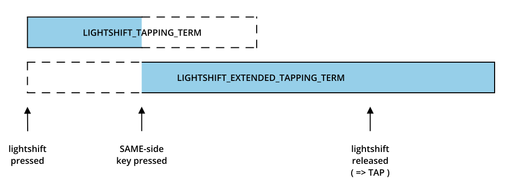
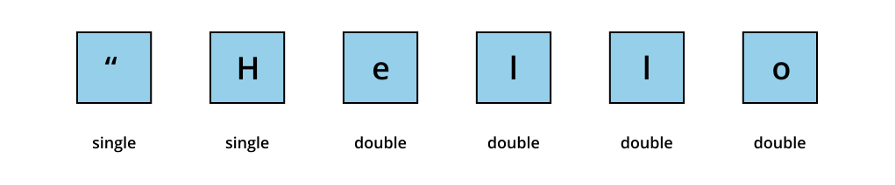
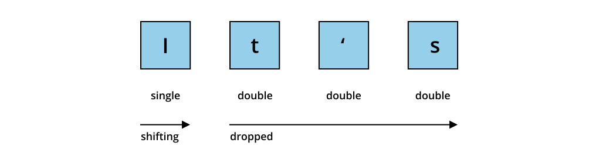
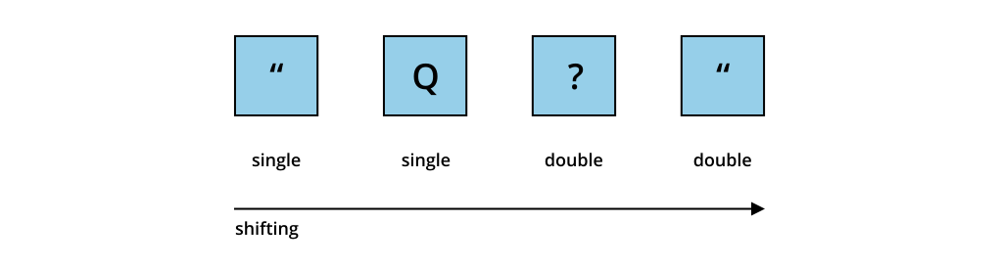

# Lightshift

<table>
<tr><td><b>Module</b></td><td><tt>dave-thompson/lightshift</tt></td></tr>
<tr><td><b>Version</b></td><td>2025-11-07</td></tr>
<tr><td><b>Maintainer</b></td><td>Dave Thompson (@dave-thompson)</td></tr>
<tr><td><b>License</b></td><td><a href="../LICENSE.txt">GNU GPLv3</a></td></tr>
</table>

## Contents

**Core** • [Misshifts Fixed](#misshifts-fixed) • [How It Works](#how-it-works) • [Chording](#important-chording)

**Configuration** • [Quick Start](#quick-start) • [Caps Word](#caps-word) • [Tapping Terms](#lightshift-tapping-terms) • [Dropshift](#dropshift-1) • [Handedness](#handedness)

**Other Modules** • [Interfaces](#interfaces) • [Compatibility](#compatibility) • [Suggested Setup](#suggested-hrm-setup) • [Alternatives](#alternatives)

**Reference** • [Troubleshooting](#troubleshooting) • [Appendices](#appendix-a-full-list-of-parameters-and-options)

## Home-Row Shifts at Speed

Home-row mods have improved a lot, but **shift** remains a problem — it's used too quickly, too often, and usually mid-flow. Chordal Hold helps, but it works best with a slower, staccato typing style, and that takes time to learn.

Lightshift makes your home-row shifts fast and flawless, no matter how you type.

## Misshifts Fixed

<div align="center">
    <picture>
        <source media="(prefers-color-scheme: light)" srcset="doc/graphite-light.svg">
        <source media="(prefers-color-scheme: dark)" srcset="doc/graphite-dark.svg">
        
    </picture>
    <br>
    <i><b>Graphite:</b> A modern layout with frequently used keys on the home-row, making it vulnerable to misshifts</i>
</div>

### 1. Accidental Same-Side Shifts

Modern layouts put the most used letters on the home row.  Common trigrams, like "str" on Graphite, are easily typed rolls.  But the hand's biomechanics cause rolled keys to be held for longer, leading to accidental shifting.  Then **"string"** becomes **"TRing".**

### 2. Missed Opposite-Side Shifts

Core home-row solutions like Chordal Hold require the use of high tapping terms and a measured, staccato typing style.  When typing speed goes up, those tapping terms are missed and that measured style is lost.  Then **"I"** becomes **"si".**

### 3. Double Shifts

Double shifts aren't specific to home-row mods, but let's fix them anyway.  When typing "Jump", the short pinky is slow to J and the long ring finger is quick to U.  Releasing shift between them doesn't always go to plan.  Then **"Jump"** becomes **"JUmp".**

## How it Works

### Extended Tapping Term

The fundamental problem is that certain **same-side** **taps** naturally take longer than **opposite-side** **holds**.  That's just the hand's biomechanics.  No single tapping term can fix this — the ranges overlap.

Lightshift combats this with two different tapping terms.  The main **Lightshift Tapping Term** is short at 150ms, eliminating Missed Opposite-Side Shifts.

<div style="text-align: center;">
    <picture>
        <source media="(prefers-color-scheme: light)" srcset="doc/opp-light.svg">
        <source media="(prefers-color-scheme: dark)" srcset="doc/opp-dark.svg">
        
    </picture>
</div>

However, if you press another same-side key within the tapping term, as in a roll like "str", the **Extended Tapping Term** kicks in.  This is an enormous 65,535ms, eliminating Accidental Same-Side Shifts.

<div style="text-align: center;">
    <picture>
        <source media="(prefers-color-scheme: light)" srcset="doc/same-light.svg">
        <source media="(prefers-color-scheme: dark)" srcset="doc/same-dark.svg">
        
    </picture>
</div>

### Dropshift

Once a lightshift resolves to Shifting, it acts like a normal shift.  You can shift-click and type punctuation as usual.

But when you capitalise a letter, Dropshift kicks in.  It consumes the shift, so that no second letter is shifted, even with shift still held down.  This solves the Double Shift Problem.

## Important: Chording

**Lightshift takes no mercy on misshifts — not even for modifier chords.**

✅ **:** Ctrl → Shift → N

❌ **:** Shift → Ctrl → N **[ ==> types "hen" ]**

If chording a lightshift with other (same-side) modifiers, the lightshift must always be the **last** modifier pressed, otherwise you will type letters instead.  It's a quick adjustment, and well worth it for home-row-shifts at speed.

**Pro Tip:** Put shift on your **index** finger — chorded mods become an easy inward roll.

## Quick Start

Add `dave-thompson/lightshift` to your `keymap.json` and all your mod-tap shifts become lightshifts straightaway.  Take her for a test flight — type as quickly and messily as you can!

```json
{
  "modules": ["dave-thompson/lumberjack", "dave-thompson/lightshift"]
}
```

(If you don't yet have a `keymap.json`, create one with the below content in the same folder as your `keymap.c` file.)

```json
{
    "modules": ["dave-thompson/lightshift"]
}
```

## Configuration Guide

### Caps Word

Caps Word is near mandatory when using Dropshift, since you can't capitalise multiple letters by holding shift.  If you don't have Caps Word already, just assign the `CW_TOGG` keycode to a key (or combo) in your keymap — or for more options, see [Caps Word](https://docs.qmk.fm/features/caps_word).

### Lightshift Tapping Terms

The `LIGHTSHIFT_TAPPING_TERM` and `LIGHTSHIFT_EXTENDED_TAPPING_TERM` are configurable in `config.h`.  (Find the best tapping term for you with [Lumberjack](../lumberjack), a keylogger that measures your typing style.)

```c
#define LIGHTSHIFT_TAPPING_TERM 140            // default is 150
#define LIGHTSHIFT_EXTENDED_TAPPING_TERM 250   // default is 65535
```

### Dropshift

Dropshift categorises keys pressed during a shift into singles and doubles.  The first shiftable key is always a single.  Once that single is 'consumed', all subsequent keys are considered doubles.  By default, only letters (A-Z) consume the single shift.

<div style="text-align: center;">
    <picture>
        <source media="(prefers-color-scheme: light)" srcset="doc/hello-light.svg">
        <source media="(prefers-color-scheme: dark)" srcset="doc/hello-dark.svg">
        
    </picture>
</div>


On ***letter*** doubles, shift is dropped until re-pressed.

<div style="text-align: center;">
    <picture>
        <source media="(prefers-color-scheme: light)" srcset="doc/its-light.svg">
        <source media="(prefers-color-scheme: dark)" srcset="doc/its-dark.svg">
        
    </picture>
</div>

On ***non-letter*** doubles, shift continues.

<div style="text-align: center;">
    <picture>
        <source media="(prefers-color-scheme: light)" srcset="doc/q-light.svg">
        <source media="(prefers-color-scheme: dark)" srcset="doc/q-dark.svg">
        
    </picture>
</div>

You can change which keys consume the single, and which keys drop shift on a double, by defining `lightshift_consume_single()` and / or `lightshift_allow_double()` in `keymap.c`.

```c
bool lightshift_consume_single(uint16_t keycode, const keyrecord_t *record) {

	// consume shift when typing @, preventing @Jess when intending @jess
	// (@ is a shifted KC_2)
	if (keycode == KC_2) return true;

	// fallback to the default implementation for other keycodes
   return lightshift_consume_single_raw(keycode, record);
}
```

```c
bool lightshift_allow_double(uint16_t keycode, const keyrecord_t *record) {
	
	// prevent accidental double-quote when typing: I"ve
	// (double quote is a shifted single quote, aka KC_QUOTE)
	if (keycode == KC_QUOTE) return false;

	// fallback to the default implementation for other keycodes
   return lightshift_allow_double_raw(keycode, record);
}
```

Or if you'd rather not use Dropshift at all, disable it in `rules.mk`:

```makefile
DROPSHIFT_ENABLE = no
```

### Handedness

Lightshift takes its best guess at which hand you use for which keys, or if you're already using Chordal Hold, Lightshift will automatically use its definition instead.

To customise handedness, define `chordal_hold_layout[][]` in your `keymap.c`, based on your existing base layer definition:

```c
// Example existing layer definition on which to base your chordal_hold_layout[][]
[0] = LAYOUT_MY_KEYBOARD(
     KC_Q,    KC_W,    KC_E,    KC_R,    KC_T,     KC_Y,    KC_U,    KC_I,    KC_O,    KC_P,
     KC_A,    KC_S,    KC_D,    KC_F,    KC_G,     KC_H,    KC_J,    KC_K,    KC_L,    KC_ENT,
     KC_Z,    KC_X,    KC_C,    KC_V,    KC_B,     KC_N,    KC_M,    KC_COMM, KC_DOT,  KC_SLSH,

                                MO(1),   KC_BSPC,  KC_SPC,  MO(2)
  ),
```
```c
// chordal_hold_layout[][] definition to add to your keymap.c
// - change LAYOUT_MY_KEYBOARD to match the layout name in your layer definition
// - add 'L' or 'R' for each of your keys (or '*' for keys you use with both hands)
const char chordal_hold_layout[MATRIX_ROWS][MATRIX_COLS] PROGMEM =
  LAYOUT_MY_KEYBOARD(
  	 'L',    'L',    'L',    'L',    'L',     'R',    'R',    'R',    'R',    'R',
     'L',    'L',    'L',    'L',    'L',     'R',    'R',    'R',    'R',    'R',
     'L',    'L',    'L',    'L',    'L',     'R',    'R',    'R',    'R',    'R',

                             'L',    'L',     'R',    'R'
  );
```
Alternatively, you can define handedness functionally, as below.  Note that 'col' and 'row' here refer to your board's electrical matrix rather than your physical keys, which can make the terms somewhat unintuitive.  If you don't know the col / row positions of your keys, use [Lumberjack](../lumberjack)'s `#define LUMBERJACK_PR` option to find them.

```c
char chordal_hold_handedness(keypos_t key) {
    return key.row < MATRIX_ROWS / 2 ? 'L' : 'R';
}
```

## Interfaces

Lightshift hooks into several parts of QMK to implement Extended Tapping Term — and to automatically disable Flow Tap, Chordal Hold and Permissive Hold on lightshift keys.  If you're using any of the below hooks in your own code, you'll need to tweak your implementations for compatibility.

### Per-Key Tapping Terms

If you have a custom `get_tapping_term()` implementation, define `LIGHTSHIFT_USER_TAPPING_TERM ` in `config.h`, then update your implementation to call lightshift's Extended Tapping Term hook.

```c
uint16_t get_tapping_term(uint16_t keycode, keyrecord_t *record) {

	// add this line at the top
    if (is_lightshift(keycode)) return get_lightshift_term(keycode, record);

    // your custom code goes here
    ...
}
```

### Flow Tap

If you have a custom `get_flow_tap_term()` implementation, define `LIGHTSHIFT_USER_FLOW_TAP` in `config.h`, then update your implementation to call lightshift's hook.

```c
uint16_t get_flow_tap_term(uint16_t keycode, keyrecord_t* record, uint16_t prev_keycode) {
                      
        // add this line at the top (so flow tap remains disabled on lightshift keys)
        if (is_lightshift(keycode)) return 0;
        
        // your custom code goes here
        ...
}
```

### Chordal Hold

If you have a custom `get_chordal_hold()` implementation, define `LIGHTSHIFT_USER_CHORDAL_HOLD` in `config.h`, then update your implementation to call lightshift's hook.

```c
bool get_chordal_hold(uint16_t tap_hold_keycode,
                      keyrecord_t* tap_hold_record,
                      uint16_t other_keycode,
                      keyrecord_t* other_record) {
                      
    // add this line at the top (so chordal hold remains disabled on lightshift keys)
    if (is_lightshift(tap_hold_keycode)) return false;
    
    // your custom code goes here
    ...
}
```

### Permissive Hold

If you have a custom `get_permissive_hold()` implementation, define `LIGHTSHIFT_USER_PERMISSIVE_HOLD` in `config.h`, then update your implementation to call lightshift's hook.

```c
bool get_permissive_hold(uint16_t keycode, keyrecord_t *record) {
                      
    // add this line at the top (so permissive hold remains disabled on lightshift keys)
    if (is_lightshift(keycode)) return false;

    // your custom code goes here
    ...
}
```

## Compatibility

### Compatible Modules

Lightshift avoids direct manipulation of the event flow, making it compatible with a wide range of QMK features and modules, including Combos, Speculative Hold, Sentence Case, Custom Shift and more.  Lightshift pairs well with Flow Tap, Chordal Hold and Permissive Hold — they won't interfere with your lightshift keys but will control your other mod-taps as usual.

### Suggested HRM Setup

#### 1. Shift Keys

Lightshift, [Caps Word](https://docs.qmk.fm/features/caps_word), and [Sentence Case](https://getreuer.info/posts/keyboards/sentence-case/index.html).

#### 2. Other HRMs

Use a high `TAPPING_TERM` (250ms) and [Flow Tap](https://docs.qmk.fm/tap_hold#flow-tap) with a high `FLOW_TAP_TERM` (200ms) to ensure HRMs don't activate while typing.  Create **custom hotkeys** for typing-related shortcuts like copy / paste so you can still use them in the midst of a fast flow.  Use [Speculative Hold](https://getreuer.info/posts/keyboards/speculative-hold/) to activate your HRMs immediately on mod-clicks.

If you really need non-shift mods while typing, [Chordal Hold](https://docs.qmk.fm/tap_hold#chordal-hold) will dull the pain. [Permissive Hold](https://docs.qmk.fm/tap_hold#permissive-hold) is popular too, but unfortunately does cause **extra** misfires which weren't there before.

## Alternatives

### Chordal Hold

Lightshift's Extended Tapping Term is a reimagined [Chordal Hold](https://docs.qmk.fm/tap_hold#chordal-hold).  Lightshift uses Chordal Hold's handedness concept (and algorithms), but acts only on the Shift keys.  This allows it to be more aggressive in eliminating misshifts, at the price that shift must explicitly be pressed last during modifier chords.

Chordal Hold lets through more misshifts, requires a slower typing style, and has a bit of a learning curve, but it's the most popular solution, it goes beyond shift to tackle all HRMs, and it chords modifiers with ease.

### SMTD

[SMTD](https://github.com/stasmarkin/sm_td) makes the tap-hold decision using key **release** timing, rather than key **hold** timing and **handedness**.  It's popular with people without split boards who don't want to worry about using the correct-sided shift key.

Rather than extending QMK's standard MT keys, it reinvents mod-tap from the ground up. This fully custom approach buys good accuracy at the price of complex setup and low compatibility with other QMK features.  There are some issues with combos, high-speed typing, and rolled keys.

### Others

There's also [Predictive Tap-Hold](https://github.com/jgandert/qmk_modules/tree/main/predictive_tap_hold), which runs a trained decision tree in your firmware!

## Troubleshooting

### I'm still getting misshifts!!!  😭

The best thing to do, before twiddling a thousand settings, is to work out why.  Install [Lumberjack](../lumberjack), a keylogger that tracks exactly which keys you pressed and when, and leave it running in the background while you type.  Then next time you have a misshift, check it to see what happened.

#### a. Missed Opposite-Side Shifts
Did you **hold** shift for less than `LIGHTSHIFT_TAPPING_TERM`?  If so, reduce `LIGHTSHIFT_TAPPING_TERM` to a value that would have triggered (but below 140ms is pushing it).

#### b. Accidental Same-Side Shifts
Was the **delta** between the shift press and the subsequent, same-side press greater than `LIGHTSHIFT_TAPPING_TERM`?  This is unusual, but if you're new to typing and slow, you may need to temporarily increase `LIGHTSHIFT_TAPPING_TERM` until you speed up.

#### c. Missing Letters at the End of Words, or with Thumb Keys
An accidental same-side shift in disguise!  Do you have Space on a thumb key?  Is its handedness `L/R` or `*`?  Pressing a home-row key then a same-side thumb key causes the home-row key to be pressed longer than usual — it should be treated as a same-side roll.  If your thumb key has `*` handedness, change it to `L/R`.

#### d. Misshifts just after Layer Switching
Does Lumberjack show a non-shift keycode that you thought was a shift key?  If you shift within ~200ms of layer switching with an LT key, QMK passes Lightshift the wrong keycode, so Lightshift ignores it.  Fix this by ensuring all MT Shift keys on the switched to layer are also MT Shift keys on the switched ***from*** layer.

## Appendix A: Full list of Parameters and Options

#### In config.h

<table>
<tr><td><b>Parameter</b></td><td><b>Effect</b></td></tr>

<tr><td><tt>LIGHTSHIFT_TAPPING_TERM</tt></td><td>Adjusts the opposite-side tapping term.  Default: 150ms.</td></tr>
<tr><td><tt>LIGHTSHIFT_EXTENDED_TAPPING_TERM</tt></td><td>Adjusts the extended (same side) tapping term.  Default: 65,535ms.</td></tr>

<tr><td><tt>LIGHTSHIFT_USER_TAPPING_TERM</tt></td><td>Allows a custom implementation of <tt>get_tapping_term()</tt>.</td></tr>
<tr><td><tt>LIGHTSHIFT_USER_FLOW_TAP</tt></td><td>Allows a custom implementation of <tt>get_flow_tap_term()</tt>.</td></tr>
<tr><td><tt>LIGHTSHIFT_USER_CHORDAL_HOLD</tt></td><td>Allows a custom implementation of <tt>get_chordal_hold()</tt>.</td></tr>
<tr><td><tt>LIGHTSHIFT_USER_PERMISSIVE_HOLD</tt></td><td>Allows a custom implementation of <tt>get_permissive_hold()</tt>.</td></tr>

</table>

#### In rules.mk

<table>
<tr><td><b>Parameter</b></td><td><b>Effect</b></td></tr>
<tr><td><tt>DROPSHIFT_ENABLE = no</tt></td><td>Disables Dropshift and recoups its firmware space.</td></tr>
</table>

## Appendix B: Resource Requirements

### Firmware Sizes
Lightshift is ~1,100 bytes, of which Extended Tapping Term is ~650 bytes, and Dropshift is ~450 bytes.  Caps Word (automatically enabled with Dropshift) is ~400 bytes and its useful `CAPS_WORD_INVERT_ON_SHIFT` option is ~200bytes.

Handedness configurations can affect firmware size by up to 300 bytes.  For the smallest possible firmware, define a custom `chordal_hold_handedness()`.

### RAM Usage
Lightshift uses ~15 bytes of static RAM, and ~30 bytes of stack.

## Appendix C: Development

### State Machine
The state machine is documented in [lightshift_tracking.c](./lightshift_tracking.c).  State transitions occur in `pre_process_record()` for Extended Tapping Term, and `process_record()` for Dropshift.

### Debugging
For debug output including state transitions, tapping term decisions and shift drop decisions, define `LIGHTSHIFT_DEBUG` in `config.h`.  Also install Lumberjack to log pre\_process\_record events, and define `LUMBERJACK_PR` in `config.h` if you want process\_record events too.

### Linking from Other Modules
Check for the `LIGHTSHIFT_ENABLE` definition to see if Lightshift is installed, or `DROPSHIFT_ENABLE` for the Dropshift sub-module.

## Epilogue: History

Having forever struggled with home-row shift, I used [Lumberjack](../lumberjack) to categorise every one of my misshifts for weeks, discovering they were not as complicated as they seemed — there were only three different misshifts, just repeated **hundreds of times**.

Enlightened by data, I realised Chordal Hold didn't quite do what I needed.  It treated shift as just another home-row-mod, not a thing of its own.  Lightshift was born.

<p align="right">
<i>lightshift: zero mercy for misshifts</i>
</p>