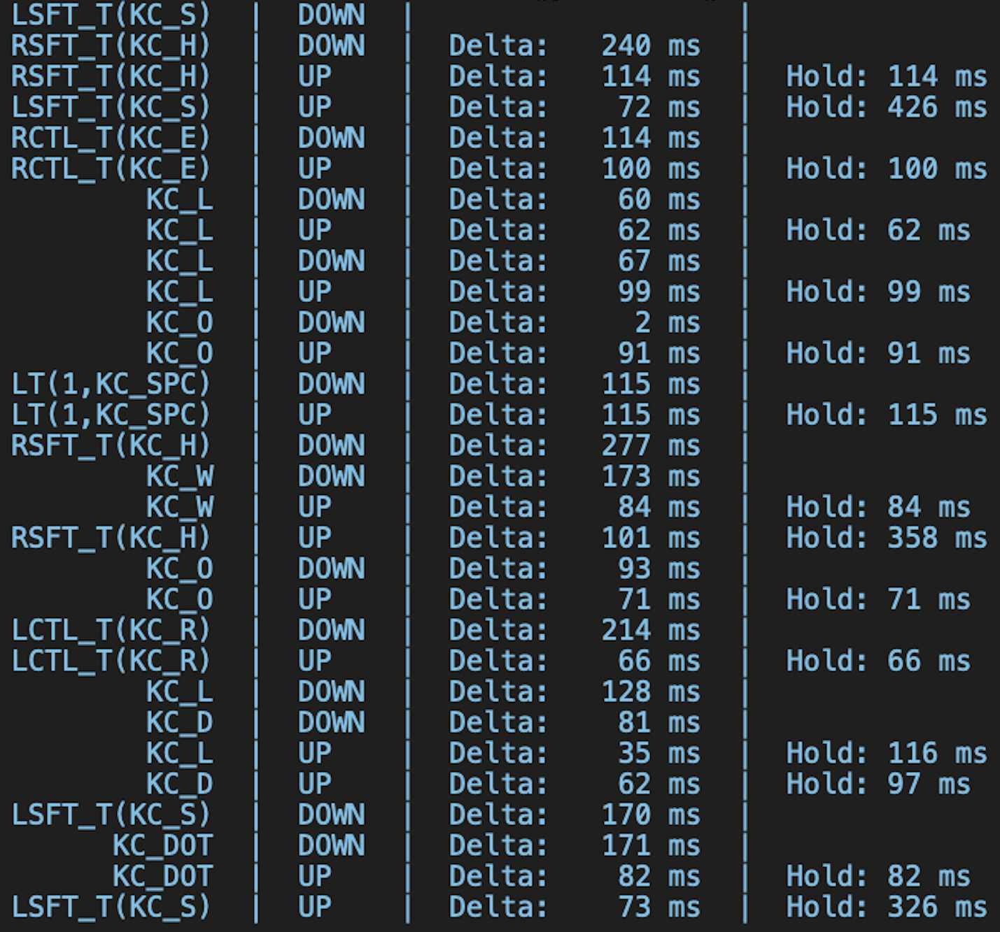
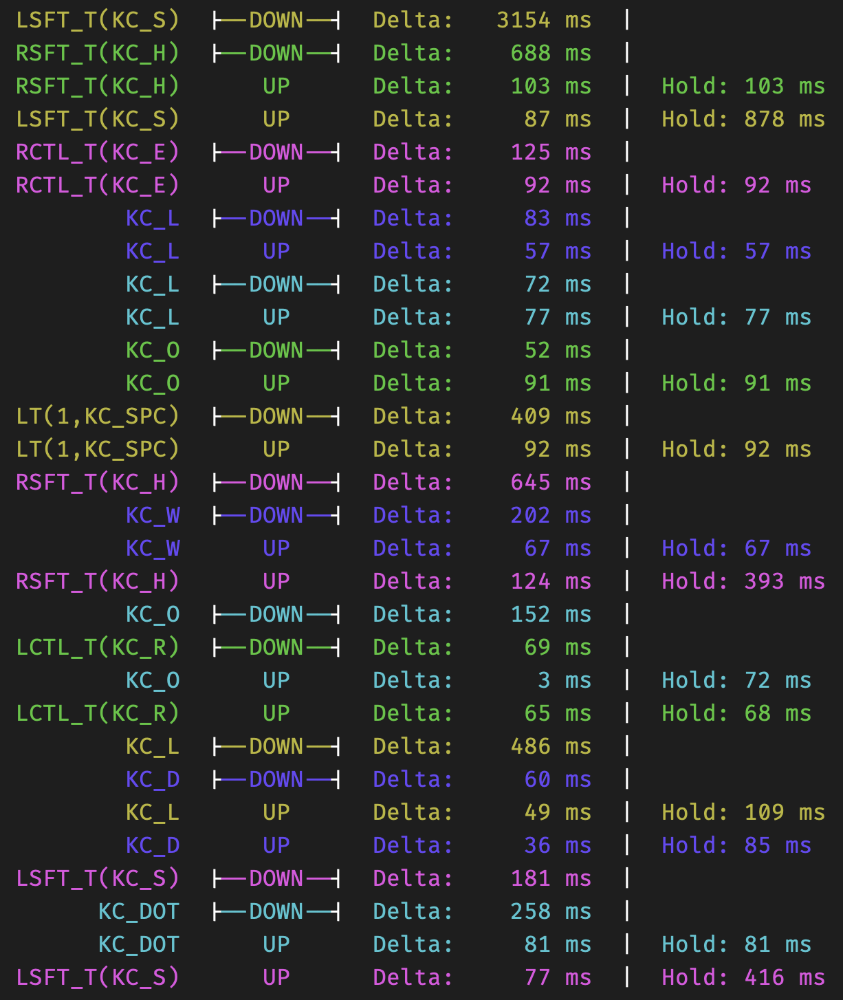

# Lumberjack

<table>
<tr><td><b>Module</b></td><td><tt>dave-thompson/lumberjack</tt></td></tr>
<tr><td><b>Version</b></td><td>2025-10-17</td></tr>
<tr><td><b>Maintainer</b></td><td>Dave Thompson (@dave-thompson)</td></tr>
<tr><td><b>License</b></td><td><a href="../LICENSE.txt">GNU GPLv3</a></td></tr>
</table>

## Pretty Key Log for Easier Debugging

Your keyboard doesn't always do what you expect.  Working out **why not** can be tricky.

[Lumberjack](https://github.com/dave-thompson/qmk-modules/lumberjack) logs every key press to the console, with deltas and hold times, letting you see **which keys you pressed and when**, so you can figure out what's going on.

## Overview


***The QMK Console:***  *Lumberjack records every key press to the console so you can see exactly which keys you pressed and when*

Every event is shown with four pieces of information:

- **Keycode:** The code for the pressed key.
- **Down / Up:** Whether the key was pressed DOWN or released UP.
- **Delta:** The amount of time since the previous logged event.
- **Hold:** The amount of time for which the key was held down.

## Quick Start
Follow the steps below to set up Lumberjack.

### a. Install a QMK Console

Lumberjack logs your keystrokes to a QMK console.  You have two console options:

- **Command Line QMK:** If you don't already have QMK installed on your machine, then follow steps 2 & 3 from the [QMK Setup Guide](https://docs.qmk.fm/newbs_getting_started) to install it.  Once QMK is installed, open a terminal window and type `qmk console` to open a QMK console in that window.

- **QMK Toolbox:**  If you don't want to install QMK or you'd rather avoid using the command line, you can instead install and use [QMK Toolbox](https://qmk.fm/toolbox). This is a little easier if you're unsure about things, but doesn't support [coloured output](#coloured-output).

### b. keymap.json

Add Lumberjack to your `keymap.json` file.  If you're already using other modules, then add Lumberjack to the **front** of the list, so it can log your key presses before other modules intercept (and potentially change) them.  Lumberjack will never interfere with modules that come after it.

```json
{
  "modules": ["dave-thompson/lumberjack", "dave-thompson/switcher"]
}
```

If you don't yet have a `keymap.json`, create one with the below content in the same folder as your `keymap.c` file.

```json
{
    "modules": ["dave-thompson/lumberjack"]
}
```

### Disabling Lumberjack
If you're done with logging for the time being, but want to keep lumberjack installed, you can temporarily disable it (and recoup 98% of its firmware space) by adding the following to your `rules.mk`:

```makefile
LUMBERJACK_ENABLE = no
```

## Optional Setup
### Coloured Output

***Coloured Console:***  *If it's not too distracting, you might prefer a colourised output, which can be enabled in config.h.*

Lumberjack's optional coloured output assigns a unique colour to each keypress, making for easier identification of the UP and DOWN parts of each press, and faster spotting of keypresses that unexpectedly overlap.  It comes at the cost of extra firmware size and is only compatible with the command-line QMK console, not with QMK Toolbox.

Enable colours by adding the following to your `config.h`:

```c
#define LUMBERJACK_COLOR
```

### Toggling On / Off at Runtime

You can add keycode `LUMBERJ` to any key in your keymap, then use that key to toggle lumberjack on / off anytime.

To toggle lumberjack programmatically, use the functions `lumberjack_on()` and `lumberjack_off()` in your code.

Note that lumberjack is **on** by default when your keyboard boots.  If you would like it to be **off** by default, add the following line to your config.h:

```c
#define LUMBERJACK_OFF_AT_BOOT
```

## Troubleshooting
### My Keycodes are Scrambled!
If your keycodes look something like `0x320B` then, well... that's just what keycodes look like!  In fact, your keyboard likes them that way.  It's normal to have **some** keycodes like this, especially for unusual keys like 'Select Word'.

If **all** your keycodes are like that, you may have `KEYCODE_STRING_ENABLE = no` in your rules.mk.  Removing that line will make your keycodes more human readable like this: `RSFT_T(KC_H)`.  (That's a Mod-Tap key that resolves to either "Right Shift" or "H".)

### My Logged Keycodes Don't Match What Was Typed
Lumberjack hooks into QMK early in its key processing architecture (in `pre_process_record`), with the aim to show you which physical keys you pressed and when.  But QMK does lots of processing after this to determine what keycodes to actually send to your computer.  Layer switches, mod-tap keys, combos, community modules like Sentence Case, and lots more will adjust the typed keycodes before they're sent on.

The hope is that, armed with the data Lumberjack gives you, you can identify which key sequences are causing problems.  Then it's up to you to work out why!  Or, if you're utterly stumped, at least you'll have some data to give to the good people of Reddit or Discord for them to help you out.

### My Firmware is Too Big to Compile
Unfortunately, older keyboards have very little memory, and pretty logging takes up a surprising amount of it.  You have several options to free up space:

1. Follow the instructions on QMK's [Squeezing AVR](https://docs.qmk.fm/squeezing_avr) page, which will free up a lot.
1. Add `KEYCODE_STRING_ENABLE = no` to your rules.mk file.  This will make your keycodes much harder to read, but will free ~1,850 bytes.
1. Temporarily comment out parts of your keymap, like LED functionality, that you can live without until you're done debugging.

### My Keycodes are Truncated
By default, Lumberjack truncates keycodes over 15 characters long to fit them in the first column of logged output.  You can increase the size of the first column by adding, e.g. `#define LUMBERJACK_KEYCODE_LENGTH 20` to your `config.h`.

### Some Deltas are Missing
The timers measure up to a maximum of 60 seconds between keystrokes.  Deltas greater than this are not reported.

### Some Key Presses "Not Tracked"
Lumberjack tracks up to 10 simultaneous key presses.  If you press 11 keys simultaneously, the 11th press will still be written to the console but instead of timing data you will see "Not Tracked" instead.  If you want to track more keys than you have fingers to press, you can do so by adding, e.g. `#define LUMBERJACK_MAX_TRACKED_KEYS 15` to your `config.h`.

### Colours Missing from Some Key Presses
To avoid being too busy, Lumberjack limits its palette to five colours.  The same colour will never be allocated to more than one simultaneous key press, meaning Lumberjack will only ever colour five keys at the same time.  Any additional simultaneous key presses will not be in colour.

## Appendix A: Full list of Parameters and Options

#### In config.h

<table>
<tr><td><b>Parameter</b></td><td><b>Effect</b></td></tr>
<tr><td><tt>LUMBERJACK_COLOR</tt></td><td>Enables coloured logging at the cost of larger firmware size.  Requires use of command-line console.</td></tr>
<tr><td><tt>LUMBERJACK_OFF_AT_BOOT</tt></td><td>Turns logging off by default.  Turn it on with <tt>lumberjack_on()</tt> or by pressing a <tt>LUMBERJ</tt> key.</td></tr>
<tr><td><tt>LUMBERJACK_KEYCODE_LENGTH</tt></td><td>Adjusts the width of the first log column.  Keycodes longer than this length will be truncated.</td></tr>
<tr><td><tt>LUMBERJACK_MAX_TRACKED_KEYS</tt></td><td>Adjusts the maximum number of simultaneously tracked keypresses.  Additional simultaneous keypresses beyond the maximum are logged without hold times and with the message <tt>NOT TRACKED</tt>.</td></tr>
<tr><td><tt>LUMBERJACK_PR</tt></td><td>Logs the <tt>process_record</tt> data (= interpreted keypresses after <b><i>QMK core</i></b> processing has completed).  This can be useful if you're writing and debugging code, but it will make your log rather noisy.</td></tr>
<tr><td><tt>LUMBERJACK_PPR</tt></td><td>Logs the <tt>post_process_record</tt> data (= interpreted keypresses after <b>all</b> processing has completed).  Also rather noisy.</td></tr>
</table>

#### In rules.mk

<table>
<tr><td><b>Parameter</b></td><td><b>Effect</b></td></tr>
<tr><td><tt>LUMBERJACK_ENABLE = no</tt></td><td>Disables Lumberjack and recoups  98% of its firmware space.  An easier alternative to repeatedly un-installing and re-installing.
<br><br>
You can not subsequently re-enable Lumberjack without recompiling.  If you want to toggle logging on and off at runtime, use <tt>LUMBERJACK_OFF_AT_BOOT</tt> instead.</td></tr>
<tr><td><tt>KEYCODE_STRING_ENABLE = no</tt></td><td>Disables human-readable keycodes to reduce firmware size.</td></tr>
</table>

## Appendix B: Resource Requirements

### Firmware Sizes
The Console is ~1,200 bytes, Lumberjack (Core) is ~1,100 bytes, Keycode String is ~1,850bytes and Lumberjack Colour is ~450bytes, for a total of ~4,600 bytes.

Lumberjack has a built-in lightweight utilities library (`lumberjack_utils.h/.c`) which provides string and keycode manipulation at a fraction of the size of standard C libraries.  The library may also be useful for other QMK logging applications.


### RAM Usage
Lumberjack uses ~115 bytes of static RAM (or ~160 with colours), plus ~60 bytes of stack.  You may reduce RAM usage by lowering the number of keys which Lumberjack tracks simultaneously.  Each simultaneously tracked key costs 11 bytes of RAM and Lumberjack tracks up to 10 simultaneous keys by default.

So if you're short on RAM and confident you'll never have more than, say, five keys pressed at the same time, add the following to `config.h`:

```c
#define LUMBERJACK_MAX_TRACKED_KEYS 5 // default is 10
```

## Appendix C: Running Tests

The `lumberjack_utils` and `lumberjack_color_queue` libraries comes with unit tests.  To run them, navigate to the `tests` directory in your terminal and enter `make test`.

<p align="right">
<i>Lumberjack: he likes logs</i>
</p>

