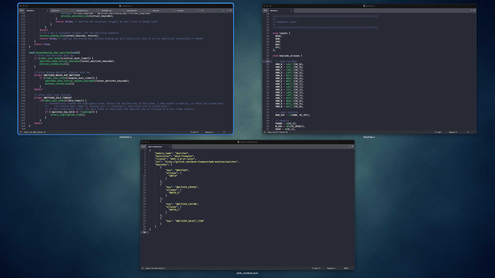

# Switcher

<table>
<tr><td><b>Module</b></td><td><tt>dave-thompson/switcher</tt></td></tr>
<tr><td><b>Version</b></td><td>2025-09-11</td></tr>
<tr><td><b>Maintainer</b></td><td>Dave Thompson (@dave-thompson)</td></tr>
<tr><td><b>License</b></td><td><a href="../LICENSE.txt">GNU GPLv3</a></td></tr>
</table>


## Single Key App Switching for your QMK Board

By default, app switching uses awkward combinations like **Cmd+Tab** or **Alt+Tab** with power features on ridiculous keys like **backtick**.  Such keys are rarely handy on a custom QMK board.

[Switcher](https://github.com/dave-thompson/qmk-modules/switcher) changes everything: cycle through apps with a single key press, map favourite features to the home row, and a whole lot more.


## Table of Contents

- [Features](#features)

- [Quick Start](#quick-start)

- [Optional Additional Setup](#optional-additional-setup)
  - [1. Secondary Keys](#1-secondary-keys)
  - [2. Dedicated Exposé Key (for MacOS)](#2-dedicated-exposé-key-for-macos)
  - [3. Custom Macro Keys](#3-custom-macro-keys)
  - [4. Multiple Switcher Keys](#4-multiple-switcher-keys)

- [Other Options](#other-options)

- [Troubleshooting](#troubleshooting)

- [Full Examples](#full-examples)
  - [1. Switcher Key on Navigation Layer](#1-switcher-key-on-navigation-layer)
  - [2. Exposé Key with Vim Bindings](#2-exposé-key-with-vim-bindings)
  - [3. Three Keys for Three Files](#3-three-keys-for-three-files)

- [Appendix A: Full List of Keycodes, Parameters and Options](#appendix-a-full-list-of-keycodes-parameters-and-options)

- [Appendix B: Resource Requirements](#appendix-b-resource-requirements)

<br/>

## Features
### Single Key Switching

***The MacOS App Manager:***  *Normally you have to hold* ***Command*** *and repeatedly press* ***Tab***.  *The Switcher module replaces this with a single key.*

Tap your Switcher key once to open the app manager, then again to cycle through windows or apps.  Switcher supports Windows Alt+Tab, Mac Cmd+Tab, or any other key combo you like.

### Automatic Selection

Press (or release) any other key and Switcher selects the highlighted item. This is ideal if your Switcher key is on an alternate layer – simply releasing the layer key will open the highlighted app.

Alternatively, tap any non-Switcher key to make the selection, or configure an idle timeout to select automatically after a brief pause.

### Secondary Keys: Advanced Features on the Home Row

App managers offer advanced features through secondary keys.  Macs allow hiding an app ('H'), quitting an app ('Q'), viewing windows of an app in Exposé ('⬆') and more.

Switcher can remap these keys to anywhere you'd like them.  How about the home row?

### Mac-Specific Enhancements
If you're on a Mac, Switcher resolves several limitations of the built-in app manager. With Switcher:

- Windows open even when minimised
- The app manager and Exposé use the same navigation keys
- Opening Exposé automatically highlights the first window
- Special Exposé keycode both opens Exposé and cycles through apps within it

### Full Key Caching
App managers take several hundred milliseconds to appear, and only cache Tab during this time.  To use advanced features, you have to wait for the interface to appear.

Switcher caches **all** keystrokes while the software loads, so you can type full sequences straight away.

### Custom Macros
Create single keys that execute complex app switching sequences for you.

Opening Exposé inside the MacOS app manager is normally six actions: Cmd Down > Tab > **Wait** > Left > Up > Cmd Up.  With Switcher Macros, a single keypress can do all this (or anything else) instantly.


<br/>


***MacOS Exposé:***  *One of several hidden features of the MacOS app manager, Exposé is accessed either via a secondary key or by Switcher's special SWITCHER_EXPOSE keycode.*

<br />

## Quick Start
Follow the steps below to set up Switcher.

For a real-world example, see my [personal keymap](https://github.com/dave-thompson/qmk-userspace/tree/main/keyboards/zsa/ergodox_ez/m32u4/glow/keymaps/dave-thompson).  For fully coded examples of different use cases, see [Full Examples](#full-examples) below.

### a. keymap.json

Add the Switcher module to your `keymap.json` file.  Generally you should place it at the **beginning** of your modules list so that subsequent modules neither affect nor are affected by your Switcher keystrokes.  (Keyloggers like Lumberjack are an exception and should usually go in front even of Switcher.)

```json
{
  "modules": ["dave-thompson/switcher", "getreuer/sentence_case"]
}
```

If you don't yet have a `keymap.json`, create one with the below content in the same folder as your `keymap.c` file.

```json
{
    "modules": ["dave-thompson/switcher"]
}
```

### b. keymap.c
Add the `SWITCHER` keycode (or its alias `SWTCH`) to your layout.  For example, let's say part of your keymap looks like this:

```c
[0] = LAYOUT_MY_KEYBOARD(
     KC_Q,    KC_W,    KC_E,    KC_R,    KC_T,     KC_Y,    KC_U,    KC_I,    KC_O,    KC_P,
     KC_A,    KC_S,    KC_D,    KC_F,    KC_G,     KC_H,    KC_J,    KC_K,    KC_L,    KC_ENT,
     KC_Z,    KC_X,    KC_C,    KC_V,    KC_B,     KC_N,    KC_M,    KC_COMM, KC_DOT,  KC_SLSH,

                                MO(1),   KC_BSPC,  KC_SPC,  MO(2)
  ),
```
To change the forward slash key (bottom right) into a Switcher key, replace `KC_SLSH` with `SWTCH`:

```c
[0] = LAYOUT_MY_KEYBOARD(
     KC_Q,    KC_W,    KC_E,    KC_R,    KC_T,     KC_Y,    KC_U,    KC_I,    KC_O,    KC_P,
     KC_A,    KC_S,    KC_D,    KC_F,    KC_G,     KC_H,    KC_J,    KC_K,    KC_L,    KC_ENT,
     KC_Z,    KC_X,    KC_C,    KC_V,    KC_B,     KC_N,    KC_M,    KC_COMM, KC_DOT,  SWTCH,

                                MO(1),   KC_BSPC,  KC_SPC,  MO(2)
  ),
```

### c. config.h
For the built-in Mac app manager, add a single line to `config.h`.  This automatically sets up Cmd-Tab as your Hold and Tap keys, and also enables the MacOS-specific enhancements:

```c
#define SWITCHER_MACOS_APP_SWITCHER
```

For other systems, you need to set the Hold and Tap keys manually.  If you're using Alt-Tab on Windows, do that as follows:

```c
#define SWITCHER_VIRTUAL_HOLD_KEY KC_LALT
#define SWITCHER_VIRTUAL_TAP_KEY KC_TAB
```

To automatically select the highlighted app shortly after your last keypress, set an Idle Timeout in milliseconds:

```c
#define SWITCHER_IDLE_TIMEOUT 1000  // 1 second timeout
```

## Optional Additional Setup

### 1. Secondary Keys
#### a. *config.h*
To use secondary keys, first enable them in your `config.h`:

```c
#define SWITCHER_ENABLE_SECONDARY_KEYS
```

#### b. *keymap.c*
Define your secondary key mappings in `keymap.c` using the `SWITCHER_SECONDARY_KEYS` macro.  The first column is the key you press and the second is the key sent to your computer.  For example:

```c
SWITCHER_SECONDARY_KEYS(
    {KC_LEFT, KC_LEFT},     // 'left' functions as usual
    {KC_RIGHT, KC_RIGHT},   // 'right' functions as usual  
    {KC_UP, KC_UP},         // 'up' functions as usual
    {KC_DOWN, KC_DOWN},     // 'down' functions as usual
    {KC_Q, KC_Q},           // 'Q' functions as usual (quit app on MacOS)
    {KC_H, KC_H},           // 'H' functions as usual (hide app on MacOS)
);

```

Or for Vim-style navigation, with Quit and Hide remapped to the home row:

```c
SWITCHER_SECONDARY_KEYS(
    {KC_H, KC_LEFT},        // 'H' sends 'left'
    {KC_J, KC_DOWN},        // 'J' sends 'down'
    {KC_K, KC_UP},          // 'K' sends 'up'
    {KC_L, KC_RIGHT},       // 'L' sends 'right'
    {KC_A, KC_Q},           // 'A' sends 'Q' to quit app
    {KC_F, KC_H},           // 'F' sends 'H' to hide app
);

```
You can remap any key, including modifier combinations.  To remap 'Paste' (Cmd-V) to 'Hide':

```c
SWITCHER_SECONDARY_KEYS(
    {G(KC_V), KC_H},        // 'Cmd-V' sends H to hide app
                            // (In QMK, G() means GUI, another name for 'Cmd'.)
);

```

### 2. Dedicated Exposé Key (for MacOS)

> [!NOTE]
> Exposé, aka Application Windows, is **not** Mission Control.  Mission Control shows **all** open windows and is navigated only by trackpad / mouse.  Exposé shows one app's windows at a time and can be navigated by keyboard.

To open Exposé directly, add `SWITCHER_EXPOSE` (or its alias `SWTCH_E`) to your keymap.  Tap the key once to show windows of the current app, then again to cycle to the windows of other apps.

### 3. Custom Macro Keys

To create a Switcher key that sends a custom macro as soon as the app manager loads, use the `SWITCHER_CUSTOM` keycode (or its alias, `SWTCH_C`) in your keymap. Then specify the keycodes to send in `config.h`.

For a Mac key that hides all windows of the **previous** app:

```c
/**
* KC_H hides the previous app (which is initially highlighted by default)
* KC_DOT exits the switcher with no further changes.
**/
#define SWITCHER_CUSTOM_MACRO {KC_H, KC_DOT}
```

For a Mac key that switches straight to the 2025_main.xls file (or really, to any window of the current app whose name starts with the number '2'):

```c
/**
* Warning: Exposé responds differently based on your screen and window setup.
*          The required sequence for your system may differ from that below.
* 
* KC_LEFT points to the current app
* KC_UP goes into Exposé
* KC_2 highlights the most recent window whose name begins with the number two
* SWITCHER_OPEN_ITEM is a special keycode that opens the highlighted
*                    app / window and closes the switcher
**/
#define SWITCHER_CUSTOM_MACRO {KC_LEFT, KC_UP, KC_2, SWITCHER_OPEN_ITEM}
```

### 4 Multiple Switcher Keys

You can use all three Primary keycodes (`SWITCHER`, `SWITCHER_EXPOSE`, `SWITCHER_CUSTOM`) on different keys for different behaviours.  (Although all must use the same app manager, as you can not specify more than one Hold key and one Tap key.)

For additional custom keys, first define a new keycode in `keymap.c`.

```c
enum custom_keycodes {
  MY_SWITCHER_KEYCODE = SAFE_RANGE,
  // Other custom keys...
};
```

Add the new keycode to the desired key in your layout, and then implement the callbacks:

```c
// tells Switcher to treat MY_SWITCHER_KEYCODE as a primary switcher key
bool is_switcher_keycode_user(uint16_t keycode) {
	return keycode == MY_SWITCHER_KEYCODE;
}

// tells Switcher which macro keystrokes to send after opening the app manager
void switcher_send_macros_user(uint16_t keycode) {
    if (keycode == MY_SWITCHER_KEYCODE) {
        switcher_send_keycode(KC_RIGHT);
        switcher_send_keycode(SWITCHER_OPEN_ITEM);
    }
}
```


## Other Options
#### 1. `SWITCHER_PRESELECT_CURRENT_APP`

Most app managers open with the previously-used app highlighted by default.  To start with the current app highlighted instead, define this option in your `config.h`.  This is useful if you use a single key for both app switching and entering Exposé.

```c
#define SWITCHER_PRESELECT_CURRENT_APP
```
#### 2. `SWITCHER_FORWARD_ENDING_KEYCODE`

By default, **ending keycodes** – i.e. keys pressed to open a window / app – are discarded as Switcher exits.  To send them on to the newly-opened app instead, add this to your `config.h`:

```c
#define SWITCHER_FORWARD_ENDING_KEYCODE
```


## Troubleshooting

### Strange Behaviour when App Manager Appears (or Misbehaving Macros)

This is usually due to keystrokes being lost.  There are two ways this can happen.

#### a) Boot Duration (the likely culprit)

Switcher caches your macros and early keystrokes until it thinks your app manager is loaded and ready to receive them.  The boot duration is the time it waits for this loading to complete.  If Switcher sends the keystrokes before your app manager is ready, they'll be lost.

Out of the box, Switcher waits for 180 milliseconds.  This is a sensible default for the Mac's built-in app manager, but is probably too fast if you're using old hardware or third-party software like Alt-Tab.

Adjust the boot duration in your config.h:

```c
#define SWITCHER_BOOT_DURATION 500 // default is 180ms
```

If your issues are on entering MacOS Exposé rather than the app manager, that takes longer to load and has a separate boot duration.  Adjust it like this:

```c
#define SWITCHER_EXPOSE_BOOT_DURATION 600 // default is 400ms
```

Overly short boot durations cause lost keystrokes and unexpected behaviour.  Overly long boot durations can cause the app manager to briefly appear in its default state before the keystrokes are applied – but keystrokes will always be sent eventually (and in the correct sequence).  When in doubt, err on the side of a longer duration.

#### b) Cache Size

The keystroke cache holds 8 keys by default, which is normally plenty.  The 8 keys include any macro **plus** all manual keystrokes before the boot period ends.  If you use long macros, increase the size in your `config.h`: 

```c
#define SWITCHER_SECONDARY_KEY_CACHE_SIZE 12 // default is 8
```
Be mindful of memory usage, especially if you have an older keyboard.  Before 2024, even expensive keyboards often came with AVR chips and only 2.5KB of RAM!

### Strange Behaviour after App Manager Exits

This is probably because Switcher is still holding Cmd/Alt.  Switcher releases Cmd/Alt when you select an app (or window) **with your keyboard**.  But if you select the app using your **mouse** instead, Switcher will not know and will keep Cmd/Alt held down.

If you use Switcher to open the app manager, never use your mouse to close it.

### MacOS Won't Switch to Fullscreen Apps

Unfortunately neither the MacOS app manager nor Exposé support fullscreen apps.  If switching to fullscreen apps is essential to you, you probably need a third-party app manager (or take the Apple approach and use Ctrl-⮕ to swap 'spaces' instead).

### Exposé Macros are Temperamental

If your Exposé macros sometimes work and sometimes don't, even with long boot durations, then Exposé itself may be the cause.  Exposé behaves differently based on your screen and window setup at the time.  Try entering your macro keycodes to Exposé manually and see if they work that way.  If not, then adjust your macro as required.

## Full Examples

### 1. Switcher Key on Navigation Layer

Anatoly uses Windows.  His Switcher key is on a navigation layer accessed via a momentary layer switch.  Since his arrow keys are on the same layer, he'll use those to navigate to the desired window.  As soon as he releases the layer key, the highlighted window will open automatically.

**Usage:** Hold Navigation layer key -> Press Switcher key -> Use arrows to navigate -> Release layer key to open

#### a. keymap.json

```json
{
  "modules": ["dave-thompson/switcher"]
}
```

#### b. keymap.c

```c
// Navigation layer
[2] = LAYOUT_MY_KEYBOARD(
     _______, _______, _______, _______, _______,  _______, _______, KC_UP,   _______,  _______,
     _______, _______, _______, _______, _______,  _______, KC_LEFT, KC_DOWN, KC_RIGHT, SWTCH,
     _______, _______, _______, _______, _______,  _______, _______, _______, _______,  _______,

                                _______, _______,  _______, _______,
  ),
```
```c
SWITCHER_SECONDARY_KEYS(
    {KC_LEFT, KC_LEFT},        // 'left' works as usual
    {KC_RIGHT, KC_RIGHT},      // 'right' works as usual
    {KC_DOWN, KC_DOWN},        // 'down' works as usual
    {KC_UP, KC_UP},            // 'up' works as usual
);
```

#### c. config.h

```c
#define SWITCHER_VIRTUAL_HOLD_KEY KC_LALT
#define SWITCHER_VIRTUAL_TAP_KEY KC_TAB
#define SWITCHER_ENABLE_SECONDARY_KEYS

```

### 2. Exposé Key with Vim Bindings
Jenny uses Mac Exposé.  She has an Exposé thumb key to show windows of the current app, and Vim bindings to navigate them.  She uses 'F' with her left index if she needs a window from a different app.  She hits the Enter key to switch to the selected window.

**Usage:** Press Switcher Exposé key to open Exposé -> Use HJKL to navigate, or F to view windows of next app -> Enter to select

#### a. keymap.json

```json
{
  "modules": ["dave-thompson/switcher"]
}
```

#### b. keymap.c

```c
[0] = LAYOUT_MY_KEYBOARD(
     KC_Q,    KC_W,    KC_E,    KC_R,    KC_T,     KC_Y,    KC_U,    KC_I,    KC_O,    KC_P,
     KC_A,    KC_S,    KC_D,    KC_F,    KC_G,     KC_H,    KC_J,    KC_K,    KC_L,    KC_COLN,
     KC_Z,    KC_X,    KC_C,    KC_V,    KC_B,     KC_N,    KC_M,    KC_COMM, KC_DOT,  KC_BSPC,

                                MO(1),   SWTCH_E,  KC_SPC,  KC_ENT
  ),
```
```c
SWITCHER_SECONDARY_KEYS(
    {KC_H, KC_LEFT},        // 'H' sends 'left'
    {KC_J, KC_DOWN},        // 'J' sends 'down'
    {KC_K, KC_UP},          // 'K' sends 'up'
    {KC_L, KC_RIGHT},       // 'L' sends 'right'
    {KC_F, KC_GRAVE},       // 'F' sends 'backtick' to cycle Exposé through
                            //            different apps
);
```

#### c. config.h

```c
#define SWITCHER_MACOS_APP_SWITCHER
#define SWITCHER_ENABLE_SECONDARY_KEYS

```

### 3. Three Keys for Three Files
Sumit uses a Mac and works with three specific files.  He has dedicated keys to switch directly to each one.

**Usage:** Press S\_SUMM, S\_DATA, or S\_ANLY to switch directly to the Summary, Data, or Analysis files.

#### a. keymap.json

```json
{
  "modules": ["dave-thompson/switcher"]
}
```

#### b. keymap.c

```c
enum custom_keycodes {
  S_SUMM = SAFE_RANGE,
  S_DATA,
  S_ANLY,
};
```
```c
[0] = LAYOUT_MY_KEYBOARD(
     KC_Q,    KC_W,    KC_E,    KC_R,    KC_T,     KC_Y,    KC_U,    KC_I,    KC_O,    KC_P,
     KC_A,    KC_S,    KC_D,    KC_F,    KC_G,     KC_H,    KC_J,    KC_K,    KC_L,    KC_COLN,
     KC_Z,    KC_X,    KC_C,    KC_V,    KC_B,     KC_N,    KC_M,    KC_COMM, KC_DOT,  KC_SLSH,

                      S_SUMM,  S_DATA,  S_ANLY,    KC_TAB,  KC_SPC,  KC_ENT,  
  ),
```
```c
bool is_switcher_keycode_user(uint16_t keycode) {
    return keycode == S_SUMM
        || keycode == S_DATA
        || keycode == S_ANLY;
}

void switcher_send_macros_user(uint16_t keycode) {
    if (keycode == S_SUMM) {
        switcher_send_keycode(KC_LEFT);             // Select current app
        switcher_send_keycode(KC_UP);               // Enter Exposé
        switcher_send_keycode(KC_S);                // Select 1st window whose
                                                    //    name begins with 'S'
        switcher_send_keycode(SWITCHER_OPEN_ITEM);  // Open that window 
    }
    if (keycode == S_DATA) {
        switcher_send_keycode(KC_LEFT);             // Select current app
        switcher_send_keycode(KC_UP);               // Enter Exposé
        switcher_send_keycode(KC_D);                // Select 1st window whose
                                                    //    name begins with 'D'
        switcher_send_keycode(SWITCHER_OPEN_ITEM);  // Open that window 
    }
    if (keycode == S_ANLY) {
        switcher_send_keycode(KC_LEFT);             // Select current app
        switcher_send_keycode(KC_UP);               // Enter Exposé
        switcher_send_keycode(KC_A);                // Select 1st window whose
                                                    //    name begins with 'A'
        switcher_send_keycode(SWITCHER_OPEN_ITEM);  // Open that window 
    }
}
```

#### c. config.h

```c
#define SWITCHER_MACOS_APP_SWITCHER

```
<br/>

## Appendix A: Full List of Keycodes, Parameters and Options

### Keycodes
<table>
<tr><td><b>Primary Keycode</b></td><td><b>Alias</td></b></tr>
<tr><td><tt>SWITCHER</tt></td><td><tt>SWTCH</tt></td></tr>
<tr><td><tt>SWITCHER_CUSTOM</tt></td><td><tt>SWTCH_C</tt></td></tr>
<tr><td><tt>SWITCHER_EXPOSE</tt></td><td><tt>SWTCH_E</tt></td></tr>
</table>

There is also special keycode `SWITCHER_OPEN_ITEM` which is used only in custom macros to select the highlighted item and exit.

### Configuration Parameters
#### In config.h

See the Setup and Troubleshooting sections above for example usage of each of the following parameters.


<table>
<tr><td><b>Parameter</b></td><td><b>Effect</b></td></tr>
<tr><td><tt>SWITCHER_VIRTUAL_HOLD_KEY</tt></td><td>Defines the Hold key, usually Cmd or Alt, simulated by Switcher.</td></tr>
<tr><td><tt>SWITCHER_VIRTUAL_TAP_KEY</tt></td><td>Defines the Tap key, usually Tab, simulated by Switcher.</td></tr>
<tr><td><tt>SWITCHER_MACOS_APP_SWITCHER</tt></td><td>Turns on all features specific to the built-in MacOS app manager (aka the MacOS app switcher).  Defaults the virtual Hold and Tap keys to Cmd and Tab; these defaults may be overwritten using the parameters above.</td></tr>
<tr><td><tt>SWITCHER_IDLE_TIMEOUT</tt></td><td>Applies an idle timeout from the time of the user's last keypress.  When the timeout expires, Switcher will automatically select the highlighted item and exit.</td></tr>
<tr><td><tt>SWITCHER_ENABLE_SECONDARY_KEYS</tt></td><td>Enables secondary key functionality.  Must be accompanied by a mapping of secondary keys in keymap.c.</td></tr>
<tr><td><tt> SWITCHER_PRESELECT_CURRENT_APP </tt></td><td>Automatically sends Shift-TapKey when opening the app manager, to highlight the current app rather than the previous one.</td></tr>
<tr><td><tt> SWITCHER_FORWARD_ENDING_KEYCODE </tt></td><td>Forwards any ending keycode to the newly selected app.  (By default, ending keycodes are discarded when Switcher exits.)</td></tr>
<tr><td><tt>SWITCHER_BOOT_DURATION</tt></td><td>Alters the number of milliseconds Switcher waits for your app manager to appear before sending any keycodes (default: 180).</td></tr>
<tr><td><tt>SWITCHER_EXPOSE_BOOT_DURATION</tt></td><td>Alters the number of milliseconds Switcher waits for MacOS Exposé to appear before sending any keycodes (default: 400).</td></tr>
<tr><td><tt>SWITCHER_SECONDARY_KEY_CACHE_SIZE</tt></td><td>Redefines the size of the secondary key cache (default: 8).</td></tr>
<tr><td><tt>SWITCHER_CUSTOM_MACRO</tt></td><td>Defines a list of initial keycodes to be sent automatically when pressing a SWITCHER_CUSTOM key.</td></tr>
</table>

#### In keymap.c

<table>
<tr><td><b>Macro</b></td><td><b>Effect</b></td></tr>
<tr><td><tt>SWITCHER_SECONDARY_KEYS</tt></td><td>Defines any secondary keys, as well as any remappings between keys pressed on the keyboard and virtual secondary keys sent by it.  Must be accompanied by the definition of SWITCHER_ENABLE_SECONDARY_KEYS in config.h.</td></tr>
</table>

### MacOS App Manager: Known Features for use via Secondary Keys

The MacOS app manager has several undocumented features available for use via secondary keys:

<table>
<tr><td><b>Key</b></td><td><b>Keycode</b></td><td><b>Effect</b></td></tr>
<tr><td><tt>⬅</tt></td><td><tt>KC_LEFT</tt></td><td>Navigate left</td></tr>
<tr><td><tt>⮕</tt></td><td><tt>KC_RIGHT</tt></td><td>Navigate right</td></tr>
<tr><td><tt>⬆</tt></td><td><tt>KC_UP</tt></td><td>Enter Exposé / Exposé: Navigate up</td></tr>
<tr><td><tt>⬇</tt></td><td><tt>KC_DOWN</tt></td><td>Enter Exposé / Exposé: Navigate down</td></tr>
<tr><td><tt>Q</tt></td><td><tt>KC_Q</tt></td><td>Quit highlighted app</td></tr>
<tr><td><tt>H</tt></td><td><tt>KC_H</tt></td><td>Hide highlighted app</td></tr>
<tr><td><tt>`</tt>(backtick)</td><td><tt>KC_GRAVE</tt></td><td>Exposé: View windows of next app</td></tr>
<tr><td><tt>A-Z, 0-9</tt></td><td><tt>KC_A, KC_0, etc.</tt></td><td>Exposé: Highlight window with matching name</td></tr>
<tr><td><tt>. / ESC</tt></td><td><tt>KC_DOT / KC_ESC</tt></td><td>Exit without switching</td></tr>
</table>

Other useful Mac shortcuts outside of the app manager:

<table>
<tr><td><b>Key</b></td><td><b>Effect</b></td></tr>
<tr><td><tt>Ctrl-Tab</tt></td><td>Next tab of current window</td></tr>
<tr><td><tt>Cmd-backtick</tt></td><td>Next window of current app (within current space)</td></tr>
<tr><td><tt>Ctrl-⮕</tt></td><td>Next space</td></tr>
<tr><td><tt>Ctrl-⬇</tt></td><td>Exposé for current app (across all spaces)<br><br><i>(Note: Opening Exposé this way is outside of Switcher's context.  If you want to use Exposé alongside Switcher's power features, use the SWITCHER_EXPOSE keycode instead.)</i></td></tr>
<tr><td><tt>Ctrl-⬆</tt></td><td>Mission Control<br><br><i>(Note: While Exposé shows you open windows for the current app, Mission Control shows you open windows across <b>all</b> apps.  However, Mission Control can <b>not</b> be controlled with the keyboard.)</i></td></tr>

</table>

## Appendix B: Resource Requirements

### Firmware Size

Adds 300 to 900 bytes, dependent on configuration.

### RAM Usage

Uses ~20 bytes minimum, plus ~25 bytes for a typical secondary key setup.

